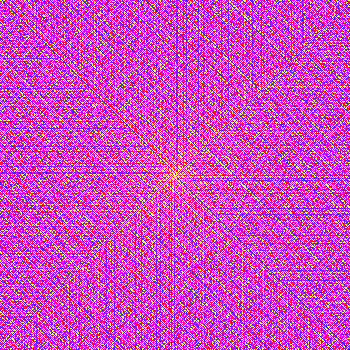
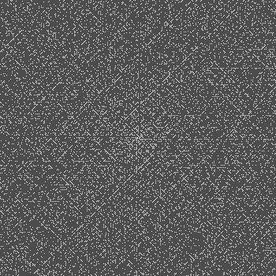
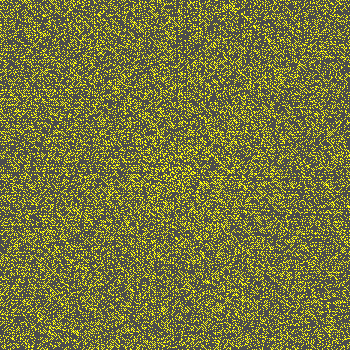
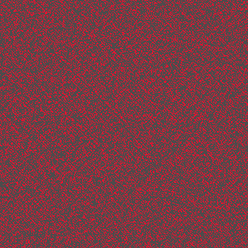
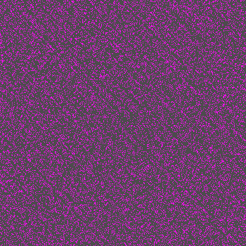
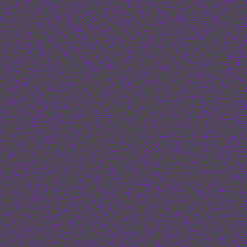

## libprimed

C library for number theory

 

Functions for working with sequences of integers: primes and composites, and more generally with number sequences considered as discrete distributions.

Includes routines for generating Ulam spirals: standard binary and enhanced composite colour gradient.

Work in progress. Routines are split between primed.h and distributions.h, not entirely satisfactorily. This library was written in the course of development of [picovideo](https://github.com/rpxpx/picovideo/). A compression optimization method in picovideo called *blokweave* utilizes the prime factorization routines to determine all divizors of a given integer.

Developed in affiliation with [Footnote Centre for Image and Text](http://footnotecentre.org/wp/), Belgrade.

---

## Installation
- System dependencies: gcc make

In unzipped or cloned directory:

`$ make` 
to compile library as libprimed.a.

`# make install` 
optionally to install headers and library in the usual places, /usr/include and /usr/lib.

`$ make ptest` 
to compile primed_test.c to executable *ptest*, which exhibits some core functions.

---

## Usage
`#include "primed.h"` 
or 
`#include "distributions.h"`

To link: 
`gcc ... -L<PATH> -l:libprimed.a` 
`gcc ... -lprimed` 
if installed.

---

### Composite Ulam spirals

 
 
 

*compositionality*

|   	          |            |	      
|-----------------|------------|
|`1...16 (all)`   |`1 (primes)`|
|`2 (semi-primes)`|`3`         |
|`4`              |`5`         |

The images above are 350-square (1...122,500) Ulam spiral plots for the composite values correspondingly listed in the table. The composite value, or grade, of natural *n* is the number of factors in the prime decomposition of *n*. Primes therefore have grade 1, semi-primes 2. 1 is considered non-prime, non-composite, and is assigned grade 0.

Each set of plots for a square size has a colour legend. Primes are always coded white, and are not shown in the legend. Composite grade 0 and all numbers to be ignored are masked with dark grey. The legend therefore represents composite grades from 2 to the maximum value in the square. The legend is the result of a colour map - a line segment through colour space - applied to adjusted *densities* of composite grades. So the legend does not necessarily show even colour distinctions across the range of composite grades.

For the numbers 1...122,500, composite grades range to 16. Frequencies are as follows:

|`1`    |`2`    |`3`    |`4`    |`5`    |`6`   |`7`   |`8`   |`9`  |`10` |`11` |`12`|`13`|`14`|`15`|`16`|
|-------|-------|-------|-------|-------|------|------|------|-----|-----|-----|----|----|----|----|----|
|`11522`|`28374`|`31225`|`23158`|`13808`|`7402`|`3689`|`1788`|`835`|`388`|`177`|`77`|`35`|`13`|`6` |`2` |

Starting from 2, these values translate to the following cumulative fractions:

|`2`    |`3`    |`4`    |`5`    |`6`   |`7`   |`8`   |`9`  |`10` |`11` |`12`|`13`|`14`|`15`|`16`|
|-------|-------|-------|-------|------|------|------|-----|-----|-----|----|----|----|----|----|
|`0.000000`|`0.378013`|`0.658366`|`0.825527`|`0.915136`|`0.959796`|`0.981441`|`0.991550`|`0.996247`|`0.998390`|`0.999322`|`0.999746`|`0.999903`|`0.999976`|`1.000000`|

Taken as points on the colour map **rgb cmap_heat_(float x)** defined in colorspace.h, those values yield the legend used above:

Composite Ulam spirals are generated with the following routine in primed.h: **int ulam_spiral_composites(FILE \*fp, rgb (\*cmap)(float n), float push, uint s, uint cplot, FILE \*lfp, uint ls)**

Square size is specified by **uint s**. The composite degree to plot is specified by **uint cplot**, where 0 plots all values. Colours are determined by passing a colour map function **rgb (\*cmap)(float n)** and a **float push** value in the interval [0,1]. *push* specifies an adjustment of the distribution of composite grade densities towards uniformity. With this mechanism, the colour spectrum provided by *cmap* can be controlled to distinguish composite grades in a continuum between density and absolute value. Using the same *cmap*, but setting *push* to 1, for example, yields the following legend for 350-squares:

Colour maps must be in the form **rgb cmap(float x)**, with domain of *x* [0,1]. A colour map can be defined simply as a vector of six rationals using the following generic routine: 
**rgb cmap_hsv(float a, float b, float c, float d, float e, float f, float x)**

Six rationals define three linear functions by slope and intersect through hue, saturation, and value, with domains [0,360], [0,1], [0,1], respectively. (Hue is interpreted as usual cyclically to accept negative numbers.)  **cmap_heat_(float x)** is specified, for instance, by (-180, 60, 0, 0.95, 0, 1).

### some other routines

**inta decompose(ulong n)** 
returns the prime decomposition (factorization) of natural *n* as an integer array of prime/exponent pairs. e.g. `decompose(2600)` `--> 2 3 5 2 13 1`

**inta divizors(ulong n)** returns all divisors of natural *n*. Divisors are found by taking the *m*-dimensional outer product of all primes in the prime decomposition of n, where there are *m* distinct primes. Divisors are returned as calculated, normally not in size order. e.g. `divizors(2600)` `--> 1 13 5 65 25 325 2 26 10 130 50 650 4 52 20 260 100 1300 8 104 40 520 200 2600`

pass through **quicksort_hoare()** to order: 
`--> 1 2 4 5 8 10 13 20 25 26 40 50 52 65 100 104 130 200 260 325 520 650 1300 2600`

---

## Limits to computation
### Limits of physical memory

**bool \*primes_bool(ulong n)** requests n\*sizeof(bool) bytes from malloc() to construct an n-length standard seive of Eratosthenes. The prime-counting function **ulong pi(ulong n)** counts the trues in the returned Boolean array.
That array can also be used as code for a printable integer sequence.

Assuming sizeof(bool)==1, the free memory required for determining primes to N, is N bytes.

On my machine with 8GB RAM and 10.8GB swap, malloc() requests fail from ~19.84GB.
In pratice, pi(n) returns values for up to n ~= 7.5 billion. Calls for n higher than this hang, or are killed by Linux.

**inta primes(ulong n)** returns an integer array of all primes <= n. It requests n\*sizeof(bool) + pi(n)\*sizeof(int) bytes from malloc() for the sieve and the integer array.

Using Gaussian prime-counting approximation pi(n) ~= n/log(n), and assuming sizeof(bool)==1 and sizeof(int)==4, the free memory required for compiling an integer array of primes to N ~= (N + 4N/log(N)) bytes. So primes(1000000000) (1 billion) requires ~1.193GB.

**inta compositionality(ulong n)** returns an integer array of composition values.
It requests n*sizeof(int) bytes from malloc() for an n-length enhanced sieve of Eratosthenes.

Assuming sizeof(int)==4, free memory required for computing compositionality to N is 4N bytes.

### Limits of data types

An upper limit is set for both sieves by the limit of *unsigned long*, which provides the indices. Assuming sizeof(long)==8, *ulong* ranges 0...2^(8*8)-1. Since we in fact start counting at 1, primality or compositionality can be determined to N = 2^64. This is indeed a large number. To be precise: 18,446,744,073,709,551,616. That is, ~18.447 billion billion, or ~18,447 quadrillion [Rucker 1988 p.79].

A more modest limit is set to the compilation of integer arrays of primes with **inta primes(ulong n)**. Assuming sizeof(int)==4, *signed int* ranges -2\^(4\*8)/2 ... 2\^(4\*8)/2-1, or -2,147,483,648 ... 2,147,483,647. This last number is in fact prime, so the largest computable array is the 105,097,565-length prime sequence 2,3,...2,147,483,647.
  
---
BIBLIOGRAPHY 
- Gardner, M. 1964 'The remarkable lore of the prime numbers' *Scientific American* 210 120-128 
- Lavrik, A. F. 1989 'Distribution of prime numbers' in *Encylcopaedia of Mathematics* ed. I. M. Vinogradov Dordrecht: Kluwer
- [Distribution of prime numbers. Encyclopedia of Mathematics. http://encyclopediaofmath.org/index.php?title=Distribution_of_prime_numbers&oldid=55104](http://encyclopediaofmath.org/index.php?title=Distribution_of_prime_numbers&oldid=55104) 
- Rucker, R. 1988 *Mind Tools* Harmondsworth: Penguin

